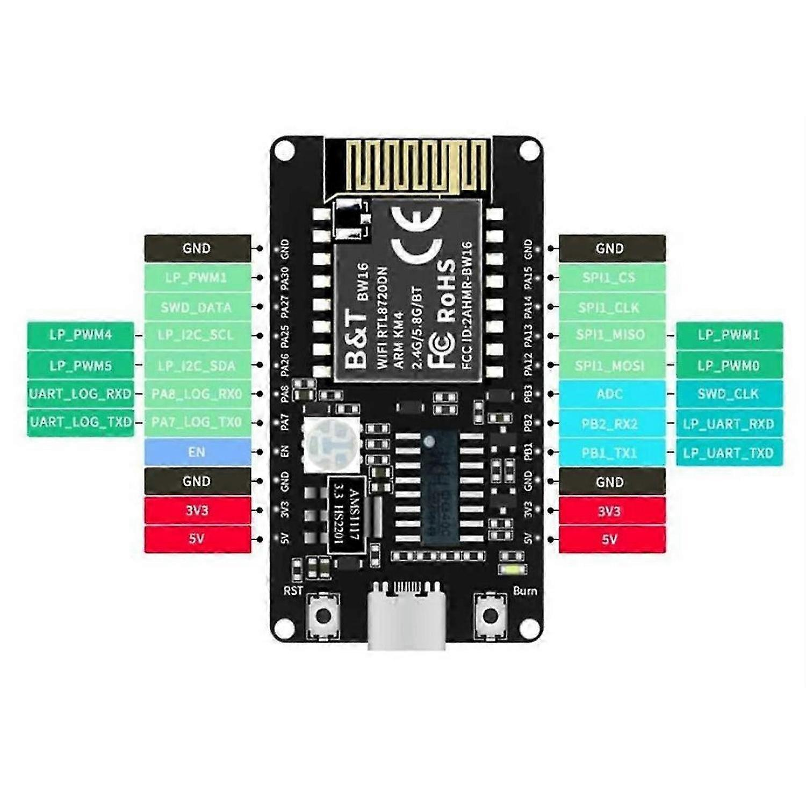

# BW16-Kit v1.2 (B&T) Pin Mapping

RTL8720DN tabanlı B&T BW16-Kit geliştirme kartı için pin tanımlamaları.

## Kart Özellikleri

- **MCU:** RTL8720DN (Dual-band WiFi 2.4G/5.8G + BLE)
- **Üretici:** B&T
- **Model:** BW16-Kit v1.2 (FCC ID: 2AHMR-BW16)
- **Flash:** 512KB (f512)
- **Toplam GPIO:** 11 pin
- **ADC Kanalları:** 1 (PB3)
- **PWM Kanalları:** 4
- **I2C:** 1 adet (LP_I2C)
- **SPI:** 1 adet (SPI1)
- **UART:** 2 adet (LOG_UART, LP_UART)
- **RGB LED:** Kart üzerinde (WS2812 veya benzeri)

## Pin Diyagramı

```
                    ┌─────────────────┐
            GND  ───┤                 ├─── GND
   PA30 (PWM1)   ───┤                 ├─── PA15 (SPI_CS)
   PA27 (SWD_DATA)──┤                 ├─── PA14 (SPI_CLK)
   PA25 (I2C_SCL)───┤   BW16-Kit      ├─── PA13 (SPI_MISO, PWM1)
   PA26 (I2C_SDA)───┤   v1.2          ├─── PA12 (SPI_MOSI, PWM0)
   PA8 (LOG_RX)  ───┤                 ├─── PB3  (ADC)
   PA7 (LOG_TX)  ───┤                 ├─── PB2  (LP_UART_RX)
            EN   ───┤                 ├─── PB1  (LP_UART_TX)
            GND  ───┤                 ├─── GND
            3V3  ───┤                 ├─── 3V3
            5V   ───┤                 ├─── 5V
                    └─────────────────┘
                      [RST]   [Burn]
```

## Pin Tablosu

### GPIO Pinleri

| Arduino Pin | MCU Pin | Alternatif Fonksiyonlar |
|-------------|---------|-------------------------|
| D0 | PA_7 | UART_LOG_TX |
| D1 | PA_8 | UART_LOG_RX |
| D2 | PA_27 | SWD_DATA |
| D3 | PA_30 | LP_PWM1 |
| D4 | PB_1 | LP_UART_TX |
| D5 | PB_2 | LP_UART_RX |
| D6 | PB_3 | ADC |
| D7 | PA_25 | LP_I2C_SCL, LP_PWM4 |
| D8 | PA_26 | LP_I2C_SDA, LP_PWM5 |
| D9 | PA_15 | SPI1_CS |
| D10 | PA_14 | SPI1_CLK |
| D11 | PA_13 | SPI1_MISO, LP_PWM1 |
| D12 | PA_12 | SPI1_MOSI, LP_PWM0, SWD_CLK |

### Analog Pinler

| Analog Pin | MCU Pin | Arduino Pin |
|------------|---------|-------------|
| A0 | PB_3 | D6 |

**Not:** PB1 ve PB2 pinleri bu kartta ADC olarak kullanılamıyor (LP_UART'a bağlı).

### LED Pinleri (Kart Üzerinde)

| LED | Renk | MCU Pin | Arduino Pin |
|-----|------|---------|-------------|
| LED_R | Kırmızı | PA_12 | D12 |
| LED_G | Yeşil | PA_14 | D10 |
| LED_B | Mavi | PA_13 | D11 |

> **Not:** LED'ler Active HIGH - HIGH=Açık, LOW=Kapalı (NICEMCU'dan farklı!)

### SPI Pinleri

| Fonksiyon | MCU Pin | Arduino Pin |
|-----------|---------|-------------|
| MOSI | PA_12 | D12 |
| MISO | PA_13 | D11 |
| SCLK | PA_14 | D10 |
| SS/CS | PA_15 | D9 |

### I2C Pinleri

| Fonksiyon | MCU Pin | Arduino Pin |
|-----------|---------|-------------|
| SDA | PA_26 | D8 |
| SCL | PA_25 | D7 |

### UART Pinleri

| UART | Fonksiyon | MCU Pin | Arduino Pin |
|------|-----------|---------|-------------|
| LOG_UART | TX | PA_7 | D0 |
| LOG_UART | RX | PA_8 | D1 |
| LP_UART | TX | PB_1 | D4 |
| LP_UART | RX | PB_2 | D5 |

### PWM Pinleri

| PWM Kanalı | MCU Pin | Arduino Pin |
|------------|---------|-------------|
| LP_PWM0 | PA_12 | D12 |
| LP_PWM1 | PA_13, PA_30 | D11, D3 |
| LP_PWM4 | PA_25 | D7 |
| LP_PWM5 | PA_26 | D8 |

## Özel Butonlar

- **RST:** Reset butonu
- **Burn:** Download/Flash modu butonu

## BW16 (Orijinal) ile Farklar

Bu kart orijinal BW16'ya oldukça benzer ancak:
- RGB LED kart üzerinde mevcut
- EN (Enable) pini dışarı çıkarılmış
- Pin sıralaması farklı

## Referans Görsel


