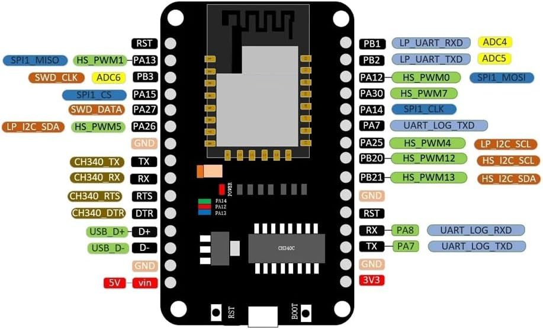

# NICEMCU_8720_v1 Pin Mapping

RTL8720DN tabanlı NICEMCU geliştirme kartı için pin tanımlamaları.

## Kart Özellikleri

- **MCU:** RTL8720DN (Dual-band WiFi + BLE)
- **USB-Serial:** CH340C
- **Toplam GPIO:** 15 pin
- **ADC Kanalları:** 3 (ADC4, ADC5, ADC6)
- **PWM Kanalları:** 8
- **I2C:** 2 adet (LP_I2C, HS_I2C)
- **SPI:** 1 adet (SPI1)
- **UART:** 2 adet (LOG_UART, LP_UART)

## Pin Diyagramı

```
                    ┌─────────────────┐
            RST  ───┤                 ├─── PB1  (LP_UART_RXD, ADC4)
   PA13 (SPI_MISO)──┤                 ├─── PB2  (LP_UART_TXD, ADC5)
    PB3 (ADC6)   ───┤                 ├─── PA12 (SPI_MOSI, PWM0)
   PA15 (SPI_CS) ───┤                 ├─── PA30 (PWM7)
   PA27 (SWD_DATA)──┤   NICEMCU       ├─── PA14 (SPI_CLK)
   PA26 (I2C_SDA)───┤   8720 v1       ├─── PA7  (LOG_TX)
            GND  ───┤                 ├─── PA25 (I2C_SCL, PWM4)
     CH340_TX    ───┤                 ├─── PB20 (HS_I2C_SCL, PWM12)
     CH340_RX    ───┤                 ├─── PB21 (HS_I2C_SDA, PWM13)
     CH340_RTS   ───┤                 ├─── GND
     CH340_DTR   ───┤                 ├─── RST
         D+      ───┤                 ├─── PA8  (LOG_RX)
         D-      ───┤                 ├─── PA7  (LOG_TX)
            GND  ───┤                 ├─── GND
         5V/Vin  ───┤                 ├─── 3V3
                    └─────────────────┘
```

## Pin Tablosu

### GPIO Pinleri

| Arduino Pin | MCU Pin | Alternatif Fonksiyonlar |
|-------------|---------|-------------------------|
| D0 | PA_7 | UART_LOG_TX |
| D1 | PA_8 | UART_LOG_RX |
| D2 | PA_27 | SWD_DATA |
| D3 | PA_30 | HS_PWM7 |
| D4 | PB_1 | LP_UART_RX, ADC4 |
| D5 | PB_2 | LP_UART_TX, ADC5 |
| D6 | PB_3 | ADC6, SWD_CLK |
| D7 | PA_25 | LP_I2C_SCL, HS_PWM4 |
| D8 | PA_26 | LP_I2C_SDA, HS_PWM5 |
| D9 | PA_15 | SPI1_CS |
| D10 | PA_14 | SPI1_CLK |
| D11 | PA_13 | SPI1_MISO, HS_PWM1 |
| D12 | PA_12 | SPI1_MOSI, HS_PWM0 |
| D13 | PB_20 | HS_I2C_SCL, HS_PWM12 |
| D14 | PB_21 | HS_I2C_SDA, HS_PWM13 |

### Analog Pinler

| Analog Pin | MCU Pin | Arduino Pin |
|------------|---------|-------------|
| A0 | PB_1 | D4 |
| A1 | PB_2 | D5 |
| A2 | PB_3 | D6 |

### LED Pinleri (Kart Üzerinde)

| LED | Renk | MCU Pin | Arduino Pin |
|-----|------|---------|-------------|
| LED_R | Kırmızı | PA_12 | D12 |
| LED_G | Yeşil | PA_13 | D11 |
| LED_B | Mavi | PA_14 | D10 |

> **Not:** LED'ler Active LOW - LOW=Açık, HIGH=Kapalı

### SPI Pinleri

| Fonksiyon | MCU Pin | Arduino Pin |
|-----------|---------|-------------|
| MOSI | PA_12 | D12 |
| MISO | PA_13 | D11 |
| SCLK | PA_14 | D10 |
| SS/CS | PA_15 | D9 |

### I2C Pinleri

| Bus | Fonksiyon | MCU Pin | Arduino Pin |
|-----|-----------|---------|-------------|
| LP_I2C | SDA | PA_26 | D8 |
| LP_I2C | SCL | PA_25 | D7 |
| HS_I2C | SDA | PB_21 | D14 |
| HS_I2C | SCL | PB_20 | D13 |

### UART Pinleri

| UART | Fonksiyon | MCU Pin | Arduino Pin |
|------|-----------|---------|-------------|
| LOG_UART | TX | PA_7 | D0 |
| LOG_UART | RX | PA_8 | D1 |
| LP_UART | TX | PB_2 | D5 |
| LP_UART | RX | PB_1 | D4 |

### PWM Pinleri

| PWM Kanalı | MCU Pin | Arduino Pin |
|------------|---------|-------------|
| HS_PWM0 | PA_12 | D12 |
| HS_PWM1 | PA_13 | D11 |
| HS_PWM4 | PA_25 | D7 |
| HS_PWM5 | PA_26 | D8 |
| HS_PWM7 | PA_30 | D3 |
| HS_PWM12 | PB_20 | D13 |
| HS_PWM13 | PB_21 | D14 |

## Referans Görsel


